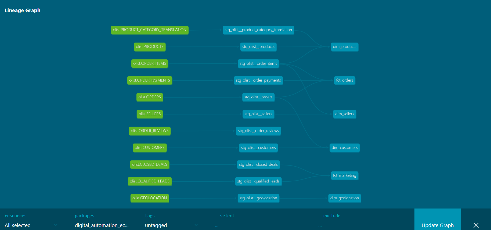

# Digital Automation — Olist Ecommerce Analytics

## Project Overview
End to end analytics engineering pipeline built for Olist, a Brazilian ecommerce marketplace client of Digital Automation. Built using dbt, Snowflake and Power BI following industry standard practices.

## Tech Stack
- **Snowflake** — Cloud data warehouse (RAW, DEV, PROD schemas)
- **dbt** — Data transformation, testing and documentation
- **Power BI** — Business intelligence dashboards
- **GitHub** — Version control and branch based development

## Data Sources
- Olist Ecommerce Dataset — 100,000 orders, 9 tables
- Olist Marketing Funnel Dataset — Lead acquisition data, 2 tables

## Pipeline Architecture
```
Raw Sources → Staging → Facts & Dimensions → Power BI
```

## Data Lineage


## Project Structure
- `models/staging` — Cleans and renames all 11 raw source tables
- `models/facts` — `fct_orders`, `fct_marketing`
- `models/dimensions` — `dim_customers`, `dim_sellers`, `dim_products`, `dim_geolocation`

## Testing
- 47 dbt tests across all models
- unique, not_null, accepted_values and relationships tests
- All tests passing

## Documentation
- Full column level descriptions on all models
- dbt lineage graph covering entire pipeline

## Analytics Engineer
Seyi Falope — Digital Automation


